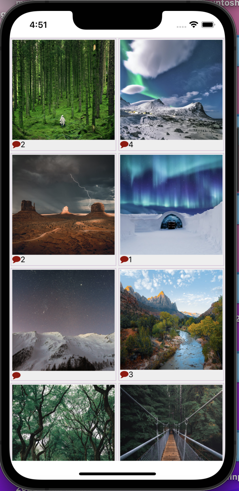
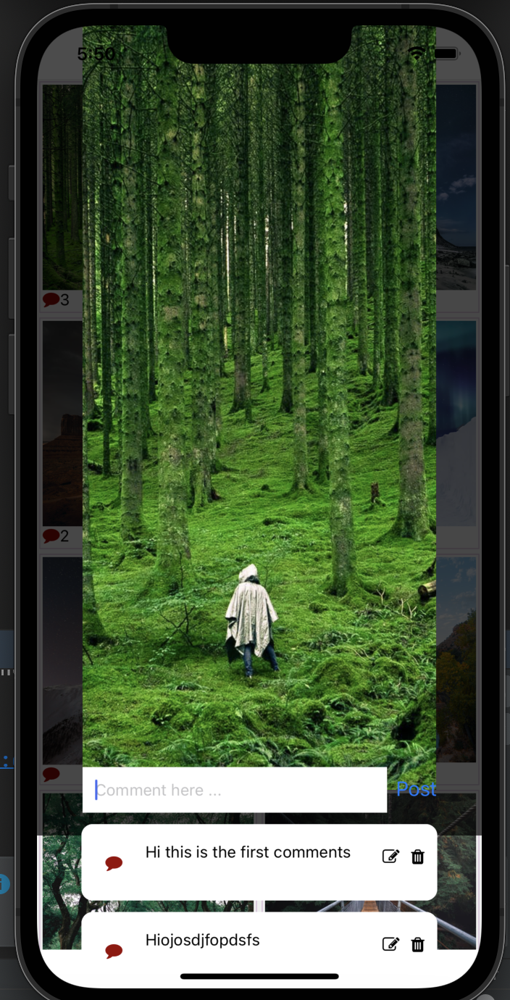
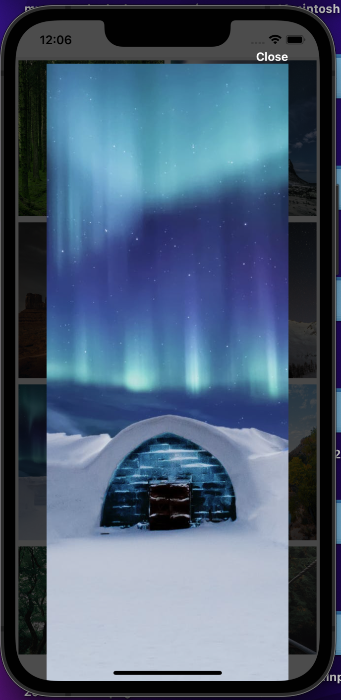
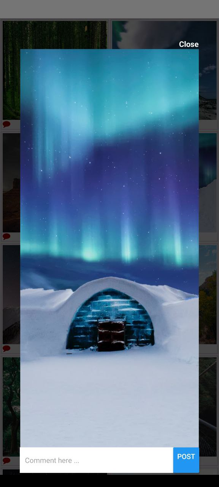

This app is created by react native cli.

To run the app please follow the instruction: 

After cloning the repository from github. 

Enter the project directory and install `node_modules` by

## `npm install`

For `ios` enter the ios directory and then run `pod install` or if you have `M1` processor based Macbook then run  `arch -arch x86_64 pod install`

There  is a patch package for `node_modules/react-native/jest/setup.js` file for testing properly.
so apply patch by  `npm run postinstall` (make sure the patch is working properly otherwise testing will be failed)

 
For comment implementation,  i have used local fake api `json-server`
## so run `json server` by:   

## `npx json-server --watch db.json`
 
Unfortunately there are some issues in this api. For example the delete function does not work in this api. if you want to delete single comment it will delete all the comments. it is not my react-native app problem. it is the backend problem as you did not give me real api to work perfectly.

Then run the app by for ios emulator following command
## `npx react-native run-ios`

Then For android run the app by following command
## `npx react-native run-android`

if it does not work for you then open the project in android studio  then try to run. 
if that is not work for you, then close the android studio completely and then open the android studio by terminal by the following command `open -a /Applications/Android\ Studio.app` then rebuild then run , it will work.

## If you want to use real device to test the app then replace the localhost from the action file with `ngrok` to make the localapi to remote api and then use that. 

 ### Technologies I have used
react-native, react, redux,redux-saga, jest

Then run the test by following command
### `npm test`

Please see the `screenshot` to see the view: when you will click the image the modal will open . In the top right corner you will find the close button to close the `Modal` 

## if you scroll the modal you will see comment field 

1. 

2.  

3. 

4. 

5. 
